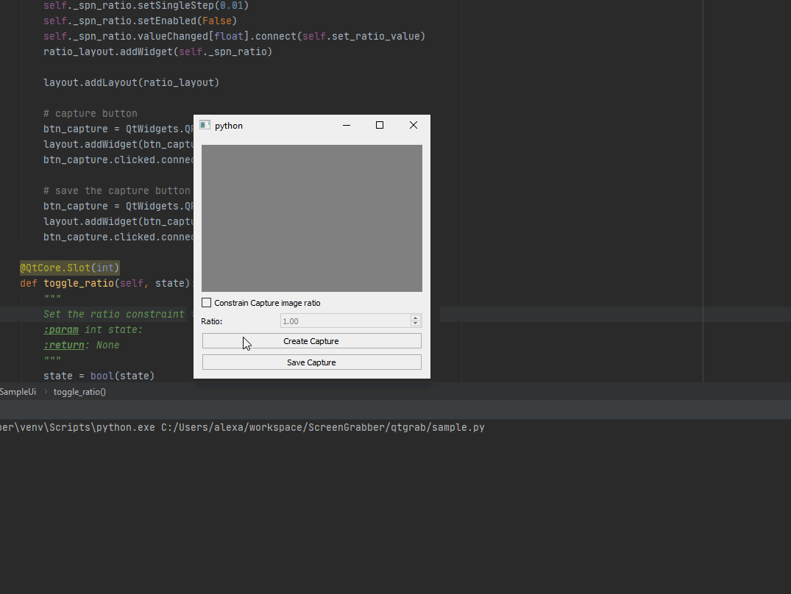

[](https://codecov.io/gh/AlexanderBerx/QtGrab)
[](https://opensource.org/licenses/MIT)
# QtGrab
Pyside2 widget for grabbing screenshots.


Note: the image above is the sample script in action. The screenshot widget 
itself is just the image area. So you yourself can implement the buttons
however you like.  
## Python 2
This package is compatible with Python 2 and 3. Python 2 isn't supported 
anymore but some applications still have Python 2 so hence why it's still 
supported.
## installation
To install the latest version of QtGrab you can run the following command:
```
pip install git+git://github.com/AlexanderBerx/QtGrab.git
```
## Sample usage
To see a demo usage of it you can run the sample script after you installed the
package. Which can be triggered by entering the following in a command line:
```
qtgrab
```
Or if you want to see a sample usage on how you can integrate it you can take
a look at the following sample script: 
Alternativley you also just use it like this in order to make any screenshots 
you want.
## testing
To be able to run the test you will have to install the test requirements 
besides the default requirements which can be done like so:
```
pip install -r tests-requirements.txt
```
After installing all of the test requirements you can run the tests using the 
following command:
```
pytest tests
```